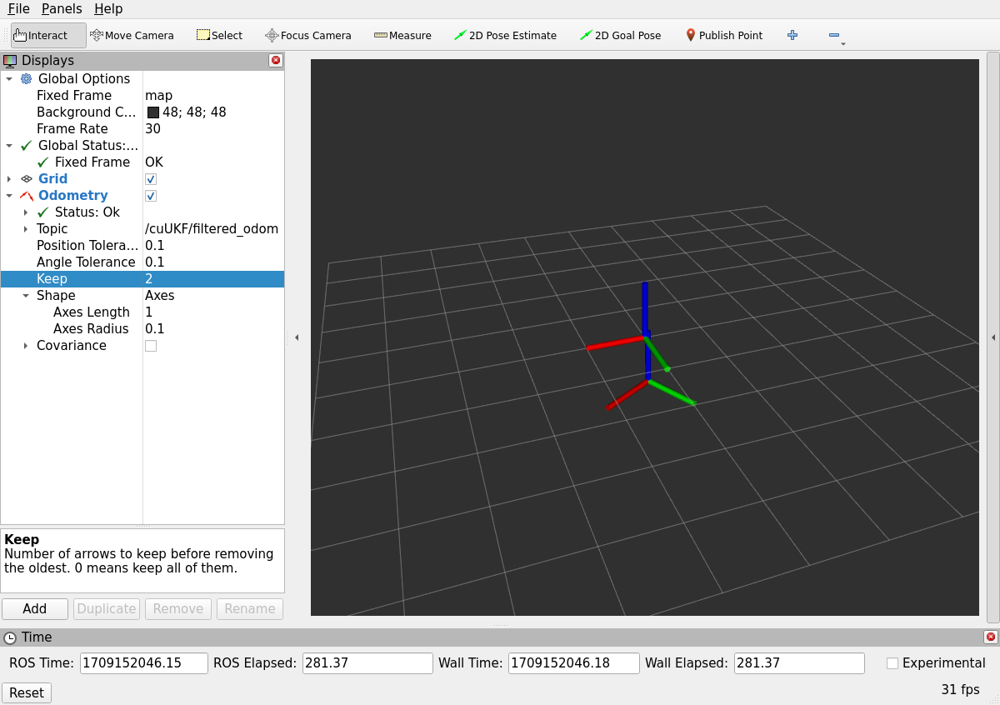
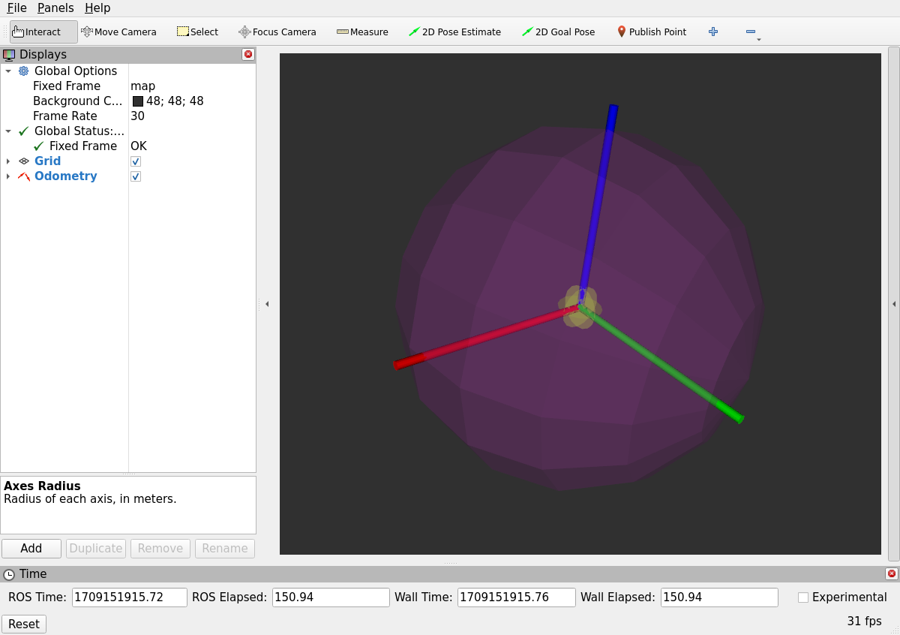

# CUDA-Accelerated-Visual-Inertial-Odometry-Fusion
Harness the power of GPU acceleration for fusing visual odometry and IMU data with an advanced Unscented Kalman Filter (UKF) implementation. Developed in C++ and utilizing CUDA, cuBLAS, and cuSOLVER, this system offers unparalleled real-time performance in state and covariance estimation for robotics and autonomous system applications.

## 🏁 Dependencies
1) NVIDIA Driver ([Official Download Link](https://www.nvidia.com/download/index.aspx))
2) CUDA Toolkit ([Official Link](https://developer.nvidia.com/cuda-downloads))
3) ROS 2 Humble ([Official Link](https://docs.ros.org/en/humble/Installation.html))

## ⚙️ Install
1) Clone `https://github.com/jagennath-hari/CUDA-Accelerated-Visual-Inertial-Odometry-Fusion.git`
2) Move `cuUKF` into `ROS2_WORKSPACE`
3) `cd ROS2_WORKSPACE` build workspace using `colcon build --symlink-install --cmake-args=-DCMAKE_BUILD_TYPE=Release --parallel-workers $(nproc)`

## 📈 Running cuUKF
Launch the node using `ros2 launch cuUKF gpu_filter.launch.py odom_topic:=/odom imu_topic:=/imu`.
The `/odom` should be replaced with your `nav_msgs/Odometry` and the `/imu` should be replaced with your `sensor_msgs/Imu`.

## 💬 ROS2 Message
The filter odometry gets published as `nav_msgs/Odometry` in the `/cuUKF/filtered_odom` topic.

## 🖼️ RVIZ2 GUI
Launch RVIZ2 using `ros2 run rviz2 rviz2` and subcribe to the `/cuUKF/filered_odom` topic.

    
    
Odometry

### Visualize the covaraince of the state

    
    
Odometry

## ⚠️ Note
1) The fusion does not consider the IMU's orientation only the visual odometry, as raw IMU dont produce orientation without addiontal filters such as complementary filter and the Madgwick filter.
2) Feel free to change the alpha, beta and kappa values along with the convariace to improve state estimates.
3) The dynamics of the system use simple equations, for the best fusion you may need to change the dynamics.
4) Consider adding augmented simga points to further increase the robustness.  